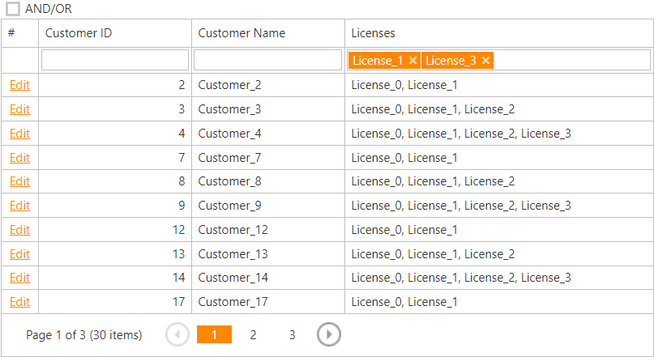

<!-- default badges list -->

<!-- default badges end -->
# Grid View for ASP.NET MVC - How to display the TokenBox editor in a filter row cell

This example demonstrates how to display the [TokenBox](https://docs.devexpress.com/AspNetMvc/16412/components/data-editors-extensions/tokenbox) editor in the Grid View's filter row for a column of the [TokenBox](https://docs.devexpress.com/AspNetMvc/DevExpress.Web.Mvc.MVCxGridViewColumnType) type.

Handle the [AutoFilterCellEditorCreate](https://docs.devexpress.com/AspNet/DevExpress.Web.Mvc.GridViewSettings.AutoFilterCellEditorCreate) event to replace a default filter row editor with the `TokenBox` editor. Handle the [ProcessColumnAutoFilter](https://docs.devexpress.com/AspNet/DevExpress.Web.Mvc.GridViewSettings.ProcessColumnAutoFilter) to apply custom filter criteria when a user changes this editor's value.

## Files to Review

* [HomeController.cs](./CS/WebApplication1/Controllers/HomeController.cs)(VB: [HomeController.vb](./VB/WebApplication1/Controllers/HomeController.vb))
* [_GridViewPartial.cshtml](./CS/WebApplication1/Views/Home/_GridViewPartial.cshtml)(VB: [_GridViewPartial.vbhtml](./VB/WebApplication1/Views/Home/_GridViewPartial.vbhtml))
* [CriteriaHelper.cs](./CS/WebApplication1/Code/CriteriaHelper.cs)(VB: [CriteriaHelper.vb](./VB/WebApplication1/Code/CriteriaHelper.vb))

## Documentation

- [Filter Row](https://docs.devexpress.com/AspNetMvc/120472/components/grid-view/data-shaping-and-manipulation/filtering/filter-row)

## More Examples

- [Access/modify a filter expression on the controller and save/load custom filters](https://github.com/DevExpress-Examples/asp-net-mvc-grid-access-and-modify-filter-expressions)
